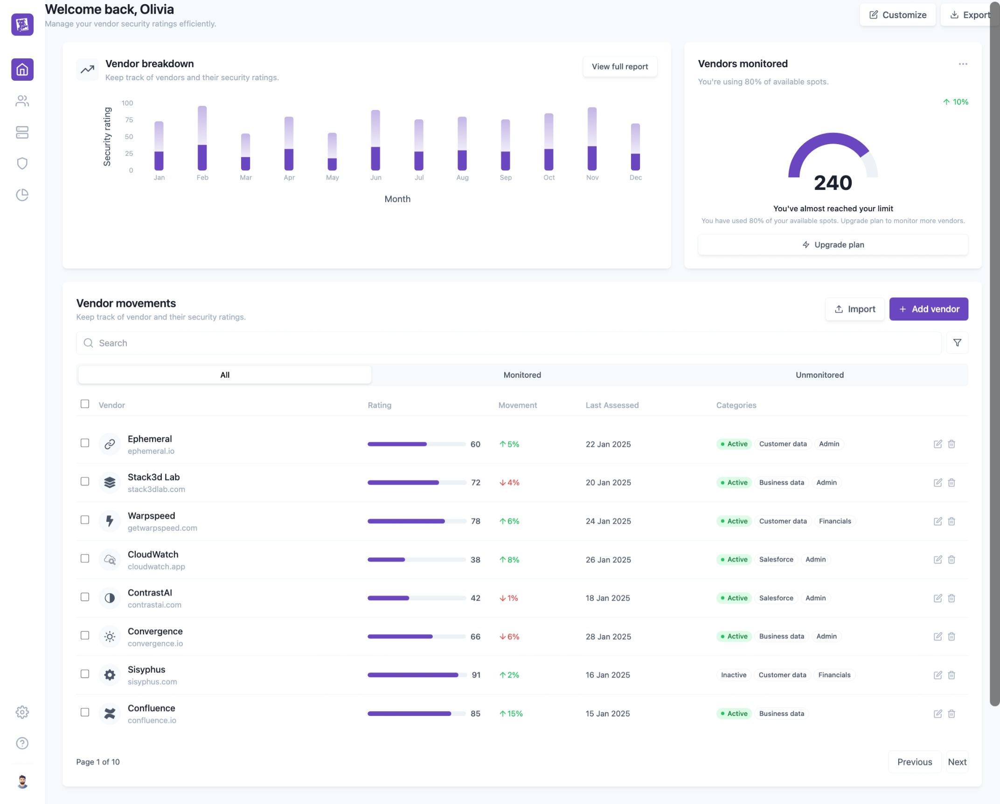
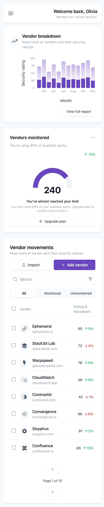

# Security Dashboard UI

A fully responsive, component-based UI for a security vendor management dashboard. This project features a clean, modern design, interactive charts, and a responsive layout that adapts from a full desktop view to a streamlined mobile experience.

## 📸 Preview


**Desktop View**


**Mobile View**


---

## 🛠️ Tech Stack

This project is built using a modern frontend stack:

- **Framework:** React
- **Build Tool:** Vite
- **Language:** TypeScript
- **Styling:** Tailwind CSS
- **Charting:** Recharts
- **Icons:** React-Icons

---

## ✨ Features

- **Fully Responsive:** A single codebase that delivers a custom UI for both desktop and mobile screens.
- **Component-Based:** Built with reusable components for `Buttons`, `Widgets`, `Tags`, and more.
- **Responsive Sidebar:** A full sidebar on desktop and a hamburger-triggered, overlay-style sidebar on mobile.
- **Interactive Charts:**
  - A stacked bar chart (`VendorBreakdown`) with custom tooltips and labels.
  - A gauge chart (`VendorsMonitored`) with a custom layout.
- **Complex Responsive Table:**
  - **Desktop:** A rich data table (`VendorMovements`) with 7 columns (Rating, Movement, Tags, etc.).
  - **Mobile:** The same table intelligently collapses to a simple, clean 2-column view.
- **Client-Side Data:** All data is served from static mock files in `/src/data`, with live search and filtering logic handled in-component.

---

## 🚀 Getting Started

Follow these instructions to get the project up and running on your local machine.

### Prerequisites

You must have [Node.js](https://nodejs.org/en/) (v18 or later) and `npm` (or `yarn`) installed on your computer.

### Installation & Running

1.  **Clone the repository** (or download the code):

    ```bash
    git clone https://github.com/MohitHereVats/security-dashboard.git
    ```

2.  **Navigate to the project directory:**

    ```bash
    cd security-dashboard
    ```

3.  **Install the dependencies:**

    ```bash
    npm install
    ```

4.  **Run the development server:**

    ```bash
    npm run dev
    ```

5.  **Open the app:**
    Vite will start the server and provide a local URL in your terminal (usually `http://localhost:5173`). Open this URL in your browser to see the application.
